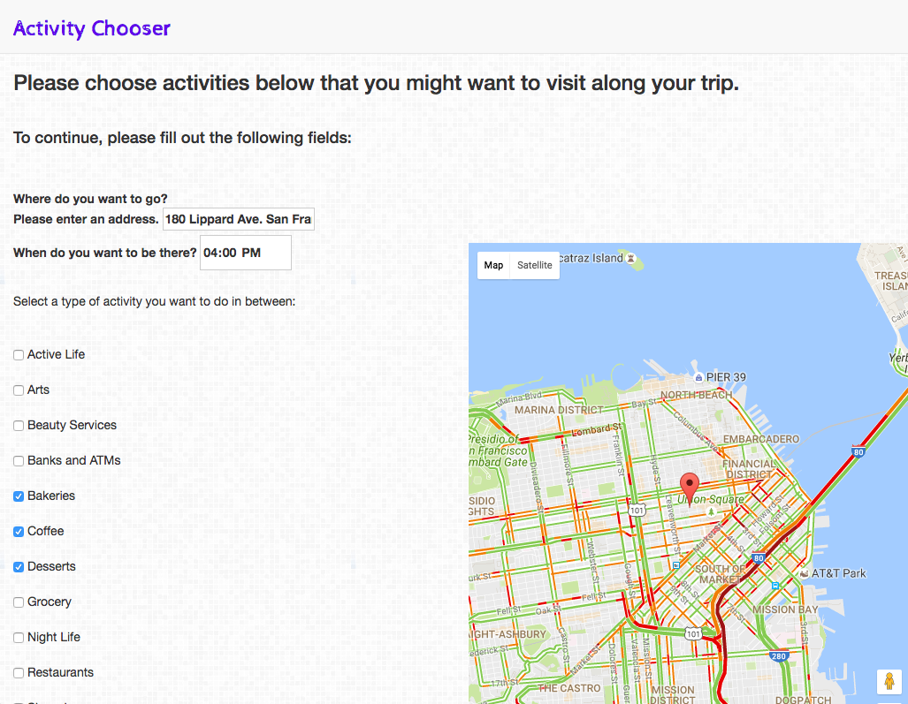
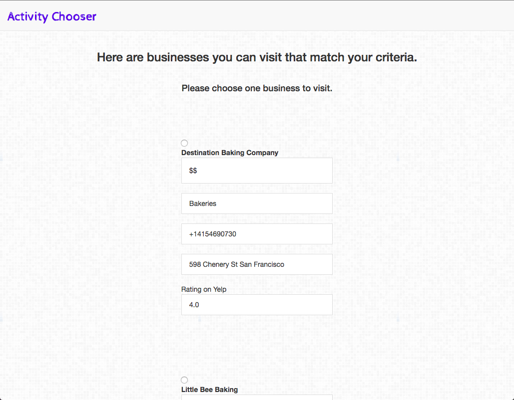
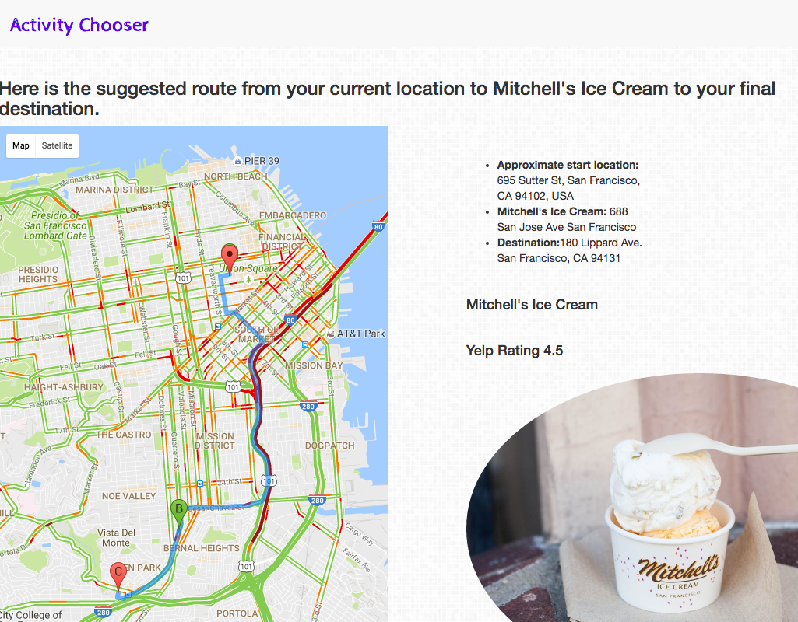

# Activity Chooser

This is my Hackbright Project as a member of the Ada cohort from July 2016 - September 2016. I am currently seeking employment as a Software Engineer. Please feel free to direct any questions or comments to me at rachelwshen@gmail.com. 

Ever plan to arrive somewhere early and want to see what activities are near your destination? Activity Chooser is a web app created by Rachel Shen which uses Yelp's API to provide pit stops that match your selection. You are provided information about the business you choose, as well as a Google Map with markers of your current location, the activity, and destination. If you prefer an activity near your current location, that is also an option!
***

## Table of Contents
1. Technologies Used
2. How to locally run Activity Chooser 
3. How to use Activity Chooser
4. Version 2.0

***

## Technologies Used
PostgreSQL, SQLAlchemy, Python, Flask, Jinja, Javascript,  JQuery, Bootstrap, HTML, CSS

[Google Maps Javascript API](https://developers.google.com/maps/documentation/directions/), [Yelp API Version 3.0](https://www.yelp.com/developers/v3/preview), and [Google Maps Geocoder API](https://developers.google.com/maps/documentation/geocoding/intro)

***
## How to locally run Activity Chooser
-Information will be provided once Activity Chooser is deployed

Run the Flask App

-Please see dependencies outlined in requirements.txt

***
## How to use Activity Chooser

-Activity Chooser consists of three pages: 

1. Homepage

2. Activity Selection

3. Final Page with route and business information

-At the homepage, the user should input a complete address and the time they want to arrive at their destination. Below, they can select (from the Yelp API category filters) activity types that interest them. Additionally, they are able to select a preference for an activity near their current location or closer to their destination. On this page, they can see their current location according to the Google Maps API. 

-Once they hit the submit button, the user is taken to the second page where they are provided businesses that match their selection from the homepage. Here, they can see the estimated price of each business, as well as the category the business falls under. Currently, this uses a Jinja loop and radio buttons so the user can choose only one business. 

-The final page provides the user with a Google map from their current location, to the business they selected, followed by their final destination. There is also an interactive image for the user to click to take them to the business's Yelp page.  

***

## Version 2.0

The next steps:

-Mouseover AJAX feature for the Yelp business link off the image on the final page

